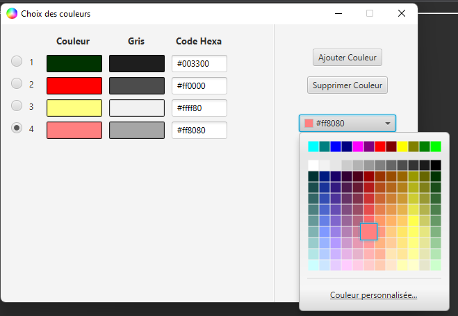
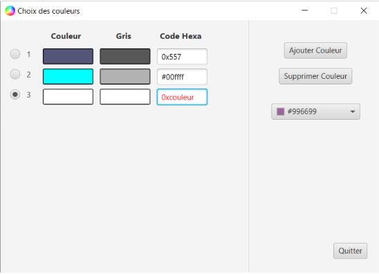

# ( Librairie nécessaire : JavaFX )

```
java --module-path "**lien vers le SDK JavaFX**\lib" --add-modules=javafx.controls,javafx.swing,javafx.fxml -jar git\Choix-Couleurs-Impression\IHM.jar
```

# Aperçu du projet 





# Description

Cette interface permet d'identifier quel niveau de gris correspond à chaque couleur choisie.

Particulièrement utile pour le choix des couleurs et l'impression des graphiques en niveaux de gris !

Il est possible de choisir les couleurs via une palette complexe ou bien en saisissant leur code hexadécimal.


# Membres de l'équipe

 - Elisa Adriaenssens
 - Romann Cornet
